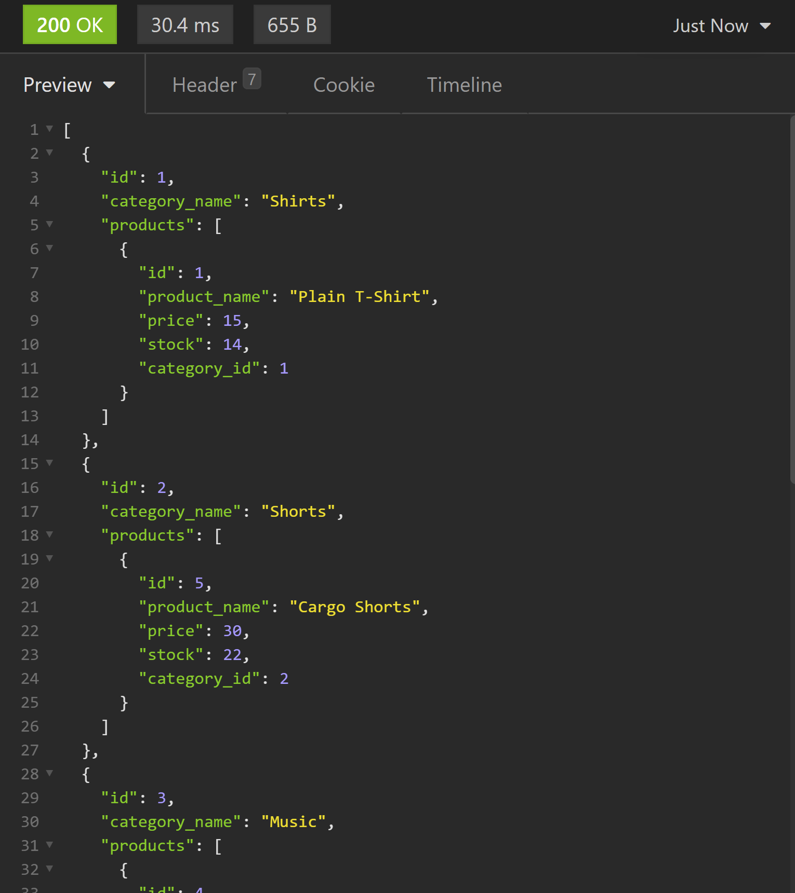

  # E-Commerce Backend
  [](https://opensource.org/licenses/MIT)

  ## Table of Contents:

  ---
  * [Description](#description)
  * [Installation](#installation)  
  * [Usage](#usage)  
  * [Credits](#credits)    
  * [Tests](#tests)  
  * [Questions](#questions)  

  ## Description

  ---
  This project is a backend data base for an e-commerce web page selling mutiple products and the database can be adapted to any products, the database includes categories, products, and tags.

  ## Installation:

  ---
  To install all necessary dependencies for this program,
  open the console and run the following command:  
  ```npm i```

  ## Usage

  ---
  This project can be used with a front end e-commerce web page to manage their products and wepage data through server commands and updating their data base rather than having to take the webpage down and hard code in all of the data. To use this project you run the server and make requests with parameters to routes. In a finished version these routes and options would be done as a styled html front end page for administrators of the E-commerce page to edit their products and page.

  

  ## Credits

  ---
  ### Third Party Assets:
  - Express.js
  - Node
  - MySQL
  - Sequalize
  - dotenev
  
  ### Third Party Docs / Contribution:
  - https://sequelize.org/master/
  - https://stackoverflow.com/

  ## Tests

  ---
  To test this application run this command in the console:  
  ```npm start```

  ## Questions

  ---
  For any questions feel free to reach out through the following contacts:  

  Email: jacob.tobin.liberty@gmail.com  
  Github: https://github.com/JacobGit3  
  
